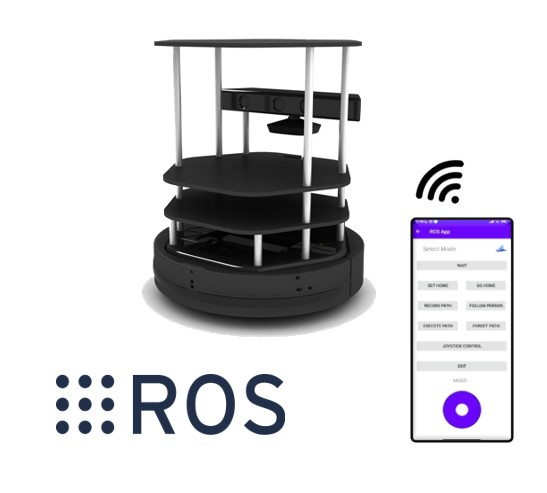

# TURTLEBOT CONTROL APP

  

## INDEX:
  
  - [1. Introduction](#p1)
  - [2. Environments](#p2)  
  - [2.1. Simulated Environment](#p2.1) 
  - [2.2. Real Environment](#p2.2)  
  - [3. Video](#p3)  
  - [4. Credits](#p4)  

## Introduction:

This is the final project of 4º Robotic Engineering at University of Alicante for the subject Mobile Robots. Different codes have been developed in `Python` so that a `TurtleBot` can do some tasks. This task are:

  - Person following
  - Save/Delete path
  - Execute path
  - Set/Delete home
  - Go home
  - Joystick control

To execute one task or another, an `Android app` is used. This app connect with the robot and send information using TCP. 
Code is estructured through a SMACH state machine. When the app send a message to the robot, code check if it is valid and change its state.

## Work environments: <a name="p2"/>

Not always real robot can be used, two versions have been created:
  - ROS Noetic simulation
  - Real TurtleBot control
    
  ### - Simulated environment: <a name="p2.1"/>
   
  Simulated environment has been coded with `Python3` on `ROS Noetic`. First of all, open Gazebo simulator, in this case, ROS defalut house map is used. On one terminal execute following commands:

    export TURTLEBOT3_MODEL=waffle
    roslaunch turtlebot3_gazebo turtlebot3_house.launch

  Open new terminal and execute navigation module (is is necessary to have previosly mapped the area):
  
    export TURTLEBOT3_MODEL=waffle
    roslaunch turtlebot3_navigation turtlebot3_navigation.launch map_file:=$HOME/house.yaml
  _Note: Both files (`.yaml` and `.pgm`) must be on `HOME` directory._
   
  This will open a rviz window where robot, map and localization point cloud can be seen. Use 2D POSE ESTIMATE to estimate the current position of the robot in the map.
  
  Execute code `main.py` and open `Andorid app`. TCP conexion uses `port:12343`

  ### - Real Environment: <a name="p2.2"/>
  
  Real environment has been coded using `Python 2` on `ROS Kinetic`. `TurtleBot` inicialization is needed, so this following commands must be launched on different terminals:

    roslaunch turtlebot_bringup minimal.launch
    roslaunch turtlebot_bringup hokuyo_ust101x.launch
    
  Open new terminal and execute the navigation module:
  
    export TURTLEBOT_3D_SENSOR=astra
    roslaunch turtlebot_navigation amcl_demo.launch map_file:=$HOME/house.yaml
   _Note: Both files (`.yaml` and `.pgm`) must be on `HOME` directory._
    
  `TurtleBot` can't open an `rviz`window so another device is needed. On new device execute `setvars.bash`, open a new terminal and execute `rviz`:
  
    rosrun rviz rviz
    
  `rviz` window will be opened. Add modules to show robot, map and point cloud.
  
  Execute code `main.py` and open `Andorid app`. TCP conexion uses `port:12343`
  _Note: in case of port malfunction, change the port and restart the application._

## Video: <a name="p3"/>

Click on the gif to see a video of the project in action:

  

## Credits: <a name="p4"/>
Built by:

  - Adrián Sanchis Reig
  - Rafael Antón Cabrera
  - Andrés Gómez-Caraballo Yélamos

